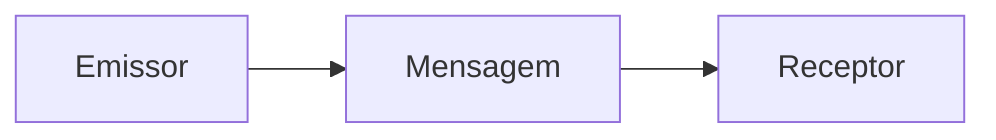
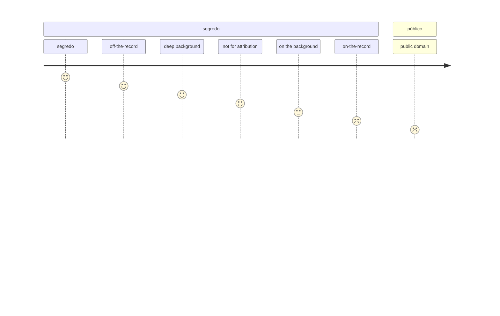

# december-2021

sem emissor não há mensagem

comunicação social une públicos fragmentados atrás de uma causa comum

marketing is price, product, placement, promotion

pirâmide operacional: conteúdo/evento/relacionamento

## alunos

- ciencias comunicacao, organização eventos
- gestão, tesouraria
- marketing, exército
- médica família
- gestao, auditoria
- ciencias empresariais, design moda
- gestão hr, formação
- director comercial IT
- advogada
- ciências comunicação

## práticas comunicação

usar a bolsa contactos (orientada à instituição)

1. press release padrão / comunicado imprensa
2. press release convocatória/confirmação
	1. usar sempre local e hora **exactos**
4. follow-up
5. conferência de imprensa
	1. **tem** de incluir q&a
		- sala pequena
		- cadeiras limitadas
		- espaço para câmaras, extensões, cabos
		- manter contacto visual com assessorado
		- declaração inicial curta, straight to the point
		- controlar a informação num curto espaço de tempo
1. declaração à imprensa
	1. **não tem** de incluir q&a
	2. usado em situação de gestão de crise
		- texto formal
		- alíneas, bullets
		- igual a um ofício escrito por advogados
		- usa cargos, títulos
2. pequeno-almoço com jornalistas / encontro informal
3. visitas/viagens de imprensa
	1. preparação logística, scouting da área, organização geral
4. press kit
	1. informação útil, preparada para ser usada quase as-is
5. primeira mão
	1. vender uma história a um único jornalista, com tempo
	2. pode ser simultâneo com pelo menos três órgãos de comunicação em simultâneo (com acordo)
6. exclusivo
	1. raro, especialmente com entrevistas
7. jornalismo transgénico
	1. publicidade em formato jornalístico
	2. notícias pagas
8. clipping
	![[./2021-12-11 11_28_08-Greenshot.png|2021-12-11 11_28_08-Greenshot.png]]
	![[./2021-12-11 11_26_58-Greenshot.png|2021-12-11 11_26_58-Greenshot.png]]
	- avaliação (AVE - advertising value equivalent)
	- distribuição
	- partilha redes sociais
9. graus de confidencialidade

![[./2021-12-11 11_54_56-Greenshot.png|2021-12-11 11_54_56-Greenshot.png]]
![[./2021-12-11 12_03_20-Greenshot.png|2021-12-11 12_03_20-Greenshot.png]]
![[./2021-12-11 12_04_27-Greenshot.png|2021-12-11 12_04_27-Greenshot.png]]

10. Spin Doctoring
	1. matriz de comportamento 
	![[./2021-12-11 12_16_31-Greenshot.png|2021-12-11 12_16_31-Greenshot.png]]
	![[./2021-12-11 12_26_04-Greenshot.png|2021-12-11 12_26_04-Greenshot.png]]
	3. definir o timing da notícia, nunca deixar que seja o jornalista a fazê-lo

![[./2021-12-11 12_27_52-Greenshot.png|2021-12-11 12_27_52-Greenshot.png]]
![[./2021-12-11 12_28_25-Greenshot.png|2021-12-11 12_28_25-Greenshot.png]]

## Comunicação de crise

- a fonte é definidora da comunicação
- quanto mais credível a fonte, maior o impacto
- antecipação
	- problema detectado e anunciado como problema é mais aceitável
- qualidade da informação
	- precisa
	- tranquilizadora
	- dinâmica
- agilidade
- veracidade
	- nunca se mente
- nunca usar primeira mão ou exclusivos

### Exemplo press kit portugal fashion

- programa
- estilistas participantes
- empresas têxteis participantes
- bio top models
- descrição quadros desfile, inspiração

## factores notícia

![[./2021-12-10 19_58_36-Greenshot 2.png|2021-12-10 19_58_36-Greenshot 2.png]]

	AIDA: Atenção, Interesse, Desejo, Acção

1. Curiosidade
2. Dinheiro
3. Sexo
4. Medo

## jornalismo

* perceber o que o repórter realmente quer
* o jornalista não é nosso amigo mas não é inimigo
* a credibilidade é o seu emprego
* têm rotinas produtivas bem conhecidas
* quem faz o jornalismo são as fontes de informação
	* directos são a excepção
	* online, noticiário tv, rádio, todos têm de ter fontes

