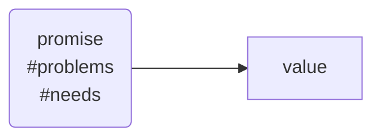
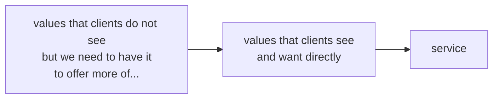

# 03-jun-2022

## values

value proposition canvas (look it up)

we make promises to deliver values

### building a hierarchical value structure

promises:

* tailor information to customer needs
* ensure client understands the information
* training will produce results

list all check points:

|promise|values we have right now|values we need to add|
|-|-|-|
|tailor information|active listening, specialist knowledge|holistic experience, individual approach|

## tech writing in central europe
*ITCQF (check it out)*
*paylab (check it out)*
average salary for tech writer:
* Poland: $1468
* Czechia: $2275
* Romania: $965
* Hungary: $1606

very simple data, salaries and headcount for tech writers

## simplified technical english
* how can you simplify technical subjects to straightforward ideas that are accompanied by a few long overdue "aha" moments
* focus on sustainable content

* from (standard):
	* in order to perform x installation process, please ensure that all of the following steps are done
* to (STE):
	* to install x, do there steps

| |standard english|simplified technical english|
|-|-|-|
|translatability **(IMPORTANT)**|less|more|
|terms|more|less|
|volume|more|less|

*derek thompson, why simple is smart (check it out)*
* technical documents are mostly written in english
* huge vocabulary (700k words), complex grammar
* many words are redundant or ambiguous

certified technical english issues come out every 3/4 years (what? where? how?)

#### STE Model
international standard for accurate and efficient documentation
* 53 writing rules (aim for 70/80% compliance)
* general vocabulary
* project-specific words

gains:
* 20% less volume
* 30/40% less translation costs
* 60% less unique terms

worst sentence in the english language: "we've always done it this way"

## Content in Industry 4.0
microcontent (check it out)

future of content:
* provide unique information response tailored for individuals in a specific given context
* developing content that predicts what we need next

emergence of content 4.0 for industry 4.0
* illustration by marie girard (IBM) Joe Gollner (Gnostyx) (check it out)

1.0 (publications)
one delivery one publisher
2.0 (topics)
one delivery one publisher
3.0 (components)
many deliveries, one publisher
4.0 (molecules & objects)
many deliveries, many publishers

molecular
* triggered by context
* indexable
* searchable
* available everywhere

what can AI produce for us?
what can we offload to AI?

1. be a lifelong learner
2. learn to beat a robot
3. adapt to survive
4. rethink how you present yourself

## where are we sailing after the pandemic
sharing the experience from akamai university training, what they planned pre-covid and what was done post-pandemic:
* Lab Validation System (in-house application running checks on hands-on lab results) (**CHECK THIS OUT**)
* added training facilitators (one senior and one junior) to help out any people that need help during training
* how to teach tutorials
* validation of activities
	* get data from ticket submission
	* student reaction survey
		* NPS score (net promoter score) on the rise
	* training impact evaluation survey (30-60 days after training)
		* how have you applied the knowledge you gained during training?
		* immediate results can be skewed by the type of questions or the likeability of the actual trainer

## onboarding new tech writers
no notes. cute but it's pretty much what we already do in terms of onboarding, could be used for reference but not much else.

*can we afford to decouple doc releases and product releases?*

## modularising content without planning
modularising means going from unstructured to structured communication
what if your current system of producing modular documentation is a monster?
*S1000D (check it out)*
*contentful (check it out)*
*lionbridge (check it out)*
*DITA (should we use something similar?)*
*can we find a decent CCMS with markdown support (integrating with JC docs, maybe?)*

she wanted to know how to describe the process of turning off google assistant to add it to the user guide, tried googling for it, no luck. then she asked google assistant and it gave her the instructions, so she put it in the user guide

* *think about creating a content model for the user guide, especially page/operation pages in business data*
* *can we integrate a content model with mkdocs? some tool has to generate the markdown, will we need to use a CMS or can we try to use some sort of a conversion toolkit like MDTK? am I overcomplicating this?*
* *can we migrate technical training from powerpoint directly from markdown exported to a publishing tool (check web presentation tool specs)*

## make sense of any API documentation mess
*speaker works at softserve (check it out)*
we must change the API documentation generation tool for all outputs (host, interface, REST), it's horrible, I can't maintain it and I want it burnt with fire
we must add a "try it live" functionality
check hackaMES project for API generation, try to use it (swagger, I think, check it out)
*stoplight (check it out)*
*flare (check it out)*
*madcap central (check it out)*
*I need control over the online documentation, if I want to push a change, I must be able to do it directly without waiting for anyone to control it. should we have some sort of release notes to mark recent changes?*
improve:
* challenge your processes
* keep experimenting
* look for improvements

## e-learning is not the future of education
disclaimer: "this presentation is based on so-called middle class. this is where I have experience, this is where I did research"

*ARCS model, by john keller (check it out)*
*marc prensky, digital nomads vs digital immigrants (check it out)*
*curve of software satisfaction (check it out)*
*digital bloom's taxonomy (check it out)*
http://gosiapytel83.net

## the future starts today
no notes, just dumb fun
