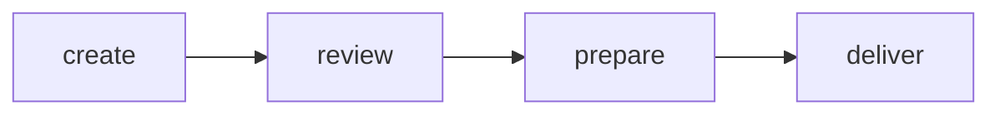
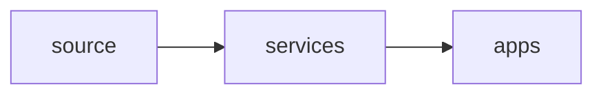

## content ops, what it is
* infrastructure
* people+processes
* delivering omni experience content at scale

content demand might not grow exponentially, but the content experience does
we might not need more content but we need content to do more things
content is the primary method of interaction in a digital first world
`heretto, check if it could be useful as a ccms, not sure it's overkill for our use cases`

**define goals, put numbers to the test**

soup vs lasagna analogy
content experiences is somewhere between dynamically assembled as it's being delivered and fully assembled by the creator

per unit cost - `can we determine this in our current situation?`

workflow:

`what can we automate?`

architecture

AI is only as good as your data

## scale docs in a fast-growing organization

works at dynatrace
`people don't spell check their presentations, sigh`
`create a mind map on who uses which portions of our docs`
`can I get automated tagging of documents? search mkdocs plugins for this`

- inline:
	- onboarding
	- in-product docs
- support
	- self-service docs
- chat
	- tickets opened by customers or internal team
- issue
	- r&d topics

`can we afford to embed a tech writer in the dev teams, even if it is in an early grooming stage? pushing them to deliver docs? a developer advocate becomes more important every day`

create a community of practice between the doc team and key developers that like to create documentation
- information sharing
- best practices
- evangelizing

their solution:
* docstack (next.js app) - LOOK IT UP, MIGHT NOT BE POSSIBLE
* docs as code
* VS code extension
* customized grammarly instance

`automatically create new markdown files with frontmatter yaml included in the template`
clear guidelines and common integrated style guide with semantic linters - PUSH THIS
`include definition of done in developer-focused documentation topics`

`we MUST get the developers to work for us, it's the only way we can scale decently`

## measure doc quality

works at livechat (~300 people)
`check their docs at github`

- **what info do users look for? do we have docs for it?**
- **can users find the info?**
- **are they able to complete procedures based on the docs?**
- if not, why? where do they get stuck?
- should feature xyz be available on mobile?

`push integrated analytics in docs, check offline possibilities for customer installation docs`
* traffic
	* most frequently visited docs get extra care
* time on page
	* misleading, people can leave the page open or they can't find the answer
* conversion
	* rewrite the doc if needed
	* difficult to track on pure text, easier on buttons
	* how to measure in internal docs?
* search results
	* amplitude and algolia (`apps, look it up`)
	* add missing results (`how?`)
	* weighed hit pages (`already on it, find out which are the most likely hits and continue pushing`)
* rating (`possibly add to mkdocs, similar to improvements channel approach`)
	* user satisfaction level
	* disappointing because subjective (same with survey)
	* depends on traffic
* survey
	* little data points
	* very subjective
	* hit or miss
* user session recordings
	* hotjar, fullstory (`apps, look it up`)
	* check user pain points
	* interaction
	* use docs grooming sessions
		* recurring meeting
		* content team * designer
		* 45 - 60 mins
		* use doc with low rating
		* look for frustrating events

ditch internal docs (**I WANT THIS SO BAD, WILL WE EVER AFFORD DO IT**)
* we are all testers, lots of internal feedback
* tight cooperation with devs
* docs part of DoD
* take into account internal procedures that may need to be kept internal

making an alliance with devs
* speak their language
* get into discussions
* help with naming

* top
	* search results
	* user session recordings
* good
	* surveys
	* ditching internal docs
* fair
	* time on page

## agile success

no notes, just a generic overall approach to diversity and variability between teams in agile-minded processes

## marry docops with devops

research project documentation
organize knowledge about the team
introduce yourself to the dev team, show your worth

communication
* ticketing process for docs (*already on it, improvements channel booming*)
* use tagging and labelling (*taxonomy push ongoing*)
* keep track of dev team's work
* invite yourself to meetings

leverage dev tools for docs:
* automate your style guide with linters (**PUSH THIS**)
* `check "Vale" app/extension for linting`
* set up code validators (`force validators on dev team, could be very useful for sql statement parsing in doc syncing`)

PR policies with linting (*move previous framework validations to mkdocs validation*)

**we already do most if not all of these things on doc side**

check akamai api docs for reference

`is there a chance to do a limited mkdocs build for PRs? current PR builds are not building mkdocs and they should, but I don't want to build the entire stack when I don't need it. can I trigger the PR build only when the changes are made on a single directory or file? and how can we do some quick validation and sanity tests?`

## flutter

`check flutter docs for developer portal ideas`
`check product adoption curve`

early adapters don't care about bugs and UX
mainstream success requires good UX and reliability

## content impact on UX

4 in a box ritual
improve inter-team communication
makes content thoughtful and deliberate
lays the groundwork for people to recognize the value of the content team
ritual components:
* product managers
* developers
* designers
* technical writers

**proof-read your presentations, goddamnit!**

## create a readability index for technical communication

`flesch-kincaid formula (check this)`
`SMOG formula (check this)`
`gunning fog index (check this)`

* create corpus with syntactic features, object/subject, phrases
	* basically train an AI model with technical communication texts
* linguistic features
	* syllable count
	* sentence length
	* semantic clarity
* AI for analysis

## no contentops without contentplan

### release planning

challenges:
plan for quarter, but multiple releases happen within the quarter
no sprints for docs
doc types
* dev docs
* product docs
* internal docs
* `zendesk (check this)`
capacity
* 5 people, 30 projects
* hard to prioritize

strategy:
original queue gets refined and docs are assigned to a doc owner
the owner doesn't write all the docs must get a writer to actually produce them
writer produces the docs
bugs or enhancements can be added to the refined queue
no scope creep!!!

### content planning

UI guide (doc portal)
APIs (swagger UI)
release notes (confluence)
system docs (confluence)
process docs (created by internal audience)

problems:
* docs scattered in various places
* unclear target audience
* inconsistency between docs
* content duplication

new plan:
* group content by audience
	* customer >> doc portal
	* internal audience >> knowledge base
	* knowledge base links to doc portal and other possible internal sources
* unify source and tools
	* static site generator * markdown
	* content migration
	* single search mechanism
* set up guidelines
	* where to publish
	* how to structure
	* who should write and who should publish

results:
* clear distinction between internal and external
* simplified contribution model
* content is easy to discover
* consistency and ownership

`asked if a role-based model was considered to join doc portal and knowledge base, they didn't do it but saw no problem in doing it`

### collaboration

problems
* input in several places
* cross-team dependencies
* discrepancies between API specs, docs and SDKs
* change management is hard to handle

solution:
* dev team creates API spec
* doc team creates API docs from schema
* PR reviewed by doc team for automatic publishing

results
* single source of truth
* clearer process
* raised team awareness

## chatgpt and agile trends

`check john seddon - rethinking it keynote speech on youtube`

no more notes, just a gimmicky presentation on trends and evolution of technology

