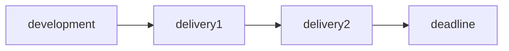
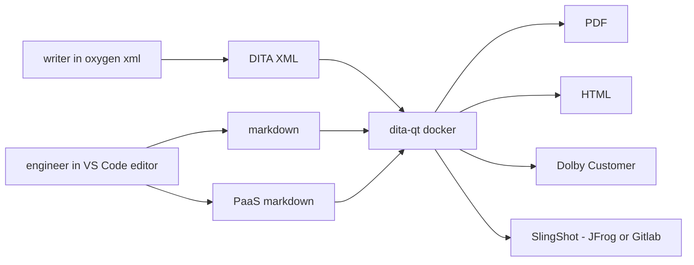
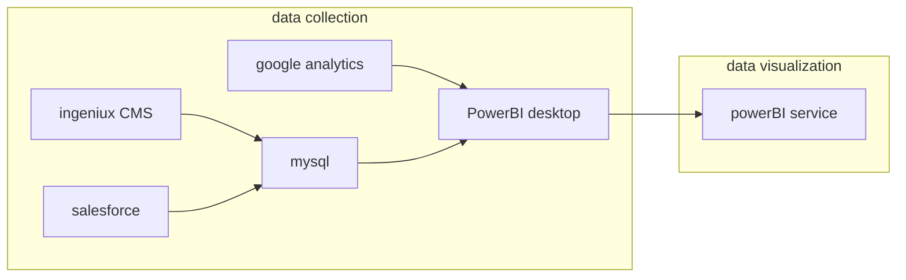

## discussion panel

### hiring

look for interest in the area
writing challenge is not the most important
look for:
* questioning mentality
* ability to prioritize
* cultural attributes beat hard skills
* figure out how to solve complex problems

### LLMs

LLM - large language model (used for chatGPT training)
`can we integrate it in our process to allow quicker (or better) operation generation or even API doc generation?`
`can we train the JC requirements into an LLM?`
use chatGPT to show you possible ways to continue writing after you're halfway there
probably the first technology in human history that we don't completely understand how it works

### documentation observability

how do you know which part is covered? and to which extent? is anything severely outdated or plain wrong? can we find hot paths for users that should be optimized?
check with support team, they're key to knowing what's outdated
`JC docs really should be converted to markdown or another searchable structure, can we ever do it? suggest mkdocs or similar to portfolio management, with some sort of tagging mechanism and taxonomy for the entire structure of the requirements overview. Ivo's approach seems to be dead in the water or at least nothing has come out of it until now, push it again`
test your docs! they should be in the QA process, if you test the docs, you also test the product
get tools to see what the user is doing (`hotjar mentioned again, check it`)

### UX research

to what extent should tech writers know about UX research methods and practices? do we need UX training?
``YES, LEARN MORE!``
sometimes you're the first person to actually use it from a user standpoint, so it's easier and useful to provide feedback on usability and operability
try removing all the words from a user interface and see how well you do with it

### metrics for doc quality

what to use? which can be automated and why?
metrics should always come from end users. ask them if it fulfills their needs, which percentage of the users can do the work after reading your docs.
try to measure support call reduction
there's no magic metric for everyone and usual business metrics don't measure quality of docs
nokia top managers had to go to the shops and answer questions from actual phone users. tough to go through but great lessons learned

## PM as a DJ

silos were used in the past especially in waterfall approaches

workflow:

docs were made post-development, peaks were inevitable, dev team gave info to docs team right before release. docs were printed (wow) just before the release
`should I review my method for documentation? current method will not scale but we don't have team capacity for much more than this. without new hires we can't really think of it imho`
what happens in the documentation when the software is patched at the last minute? (someone shouted ADD A NOTE!)
`should we notify anyone of documentation portal downtimes for updates?`
docs always up to date (PUSHING FOR THIS)
`should we add timestamps to docs?`
`make documentation a part of development process (especially for developer docs), include this information on onboarding processes`
trust is key for scaling and working together

### holon philosophy
http://docs.empathy.co (check this out)

### human values

follow CHE (not in a specifically cuban way lol)
* Curiosity
	* question the world
	* go beyond your field
	* search everywhere
* Humility
	* no impostor syndrome here
	* know your limits
	* admit your mistakes
	* know how to take criticism
	* know how to ask for help
* Empathy
	* try walking in the user's shoes
	* users don't complain out of spite
	* if you understand them, you can communicate better

## keeping the plates spinning

contentops at dolby

200 products
`try to add organically related topics through taxonomy to sidebar in mkdocs`
* online portal, static html (oxygen framework)
* offline portal as a deliverable to non-internet locations (Dolby Customer)
* pdf generation

markdown is the lesser evil
mathML in external files
`hotjar mentioned YET AGAIN (check it out for reals, especially heatmaps)`
google analytics is also a possible option (`integrated natively with material for mkdocs`)

data drives contentops
start with questions, not data sources
`improve pdf export is paramount to offline understanding. can we ditch pandoc and templating for leaner results?`

## teaching colleagues to write (and learning from them)

works at pandadoc

teaching writing:
* How
	* They are genuinely interested in writing
	* flat structure >> present initiatives and persuade people to join
	* make writing a part of skill matrix
	* measure last contribution to documentation repository as OKR (BEAUTIFUL METRIC)
	* always leave the doc better than when you found it
* Why
	* get better first drafts from devs
	* makes devs more employable
	* makes devs better thinker
	* more contributions for the project
	* endorsed by google and the pragmatic engineer (check this out)
* What
	* no slideshows. use a cheat sheet and a workbook
	* two sessions, spaced a week apart: the words and the structure
	* optional grammar before first session 
	* continuous chat session to create a community
	* make them realize how much they already know
	* use real examples from company docs
	* even if a session is awful, finish 5 minutes early lol
	* soften up on strict rules
	* `this might work for really big companies but I can't see it working for us. still, can we get Aurora to do this?`

quick tips:
* convert to active voice
* explain acronyms
* don't make promises
* remove "easy", "very", "simple"
* write a purpose statement
* people don't read, they scan

`is grammarly free to use?`
Hemingway (`readability score app, check it out`)
Vale style linter (`mentioned again, check it out`)
Diataxis framework (already know and use it, very nice)

go to developers.google.com/tech-writing/announcements

## agile to bring diverse minds together

"can you do this for me?"
"yes, but you'll have to remind me"
(**THIS IS BRILLIANT**)

push for retrospectives to check for friction

good format:
* stop
* start
* continue

`should we move to estimating user story complexity when we groom them?`
`should we set up a special emoji to signal mental health status? this is probably a company-wide idea, talk to Renata about this`

`should devs work on user-facing docs or focus on dev-facing docs? since they usually don't get the whole picture from working on specific features or sub-features, maybe a dev-facing focus should be the primary function`

## contentops and content strategy

works at ELEKS
transforming 60* website to a single unified website
* auditing existing content
* development of information architecture
* content governance
* migrate content
* training
project lasted one year
two languages supported

### auditing
* define goals and scope
* content analysis
	* quality
	* navigation
	* outdated content
	* `should we start using alt tags in images for accessibility purposes?`
* define issues
	* category
	* severity to prioritize
* detailed content audit findings report
	* include recommendations on how to improve the content

### information architecture
* create clear and consistent structure
* ensure content is easy to find and understand
* decomposition of existing pages
* taxonomy alignment
	* hierarchy for organizing information
* vocabulary harmonization
	* consistent terminology
* creation of templates for new pages
* `content-wide glossary and unified naming, maybe we should do it rather than keep talking about it for a few more years`
* taxonomy web tool (earcapable (?))
* `people here always have someone or some team that handles different aspects of their work, can't do it in CMF`
* `can we have better PDF templates to ditch pandoc and "MD to HTML to LaTeX to PDF" conversions. oob community mkdocs plugins are not usable`

### governance

* policies, processes and instructions to create content
* how is it reviewed
* RACI matrix (**ffs seriously**)
* content guidelines
* content libraries for all project deliverables
	* files with content
	* images
	* videos
	* documents, data sheets, press releases, release notes, etc.
	* `repository with templates for multiple types of documents required`

### migration

* content migration map
* checklists
	* ensure no doc is left behind
	* eliminate guesswork
`a Sofia ficaria excitadíssima como um puto numa gelataria nesta palestra, to say the least`

### training

* Drupal uses for CMS

## innersource

case study for grand parade (?)

118 software engineers, 15 dev teams, each team owned a few repositories

adaptation of open source practices to code that remains proprietary and that can be seen only within a single organization

two main actors:
 * owning team
 * contributor team

**meh, already works in CMF when DS works on Product topics**

where is the documentation in this scenario?
* `since all user stories fall under product, content team will always see and work on it, regardless of who did the code`

**losing my fucking mind at the lack of proofreading in a CONTENT conference**

## writer ratio to other roles

works at pipedrive in estonia

why measure your team?
* do you really know how the team is doing?
* do others know?
* do you need help?
* do you need to change the way you work?
* how would potential future events affect your team?
* is there support from senior leadership?
* metrics depend on team and company maturity

writer ratio:
how many people you're supporting : how many people you have

ratio is not comparable between teams

### level 1: are you keeping up with your company's growth?

engineers (* support * training team?) : tech writers
decide on an interval and a format
assess how much content work you can help with as a manager (**as if I didn't do it already**)
get historical data if available
* `try to get data from HR`

### level 2: sustainability

find your target
* danger zone
	* if the ratio is over X, burnout is closer
* creativity zone
	* if the ratio is below X, creativity is boosted

check stress levels during 1:1s

### level 3: maturing content practice

are your values as a manager reflected in how the team works? how about company values?

does the team feel involved? do they feel they matter?
customer based metrics are also important
brainstorm ideas with your team
align with company strategic goals

## imposter syndrome

works at docplanner

are operations about human beings?

thin work is responsible for imposter syndrome
* filling blanks
* starting late
* only writing
* no access to data

the disconnect is caused by:
* gatekeeping
* old habits
* assumptions
* no feedback loop
* miscommunication
* obscurity
* pressure

if you can't discuss with "them", you are not useful and become hopeless, an imposter

**nothing is obvious and that's natural**

upgrade your co-workers
* be visible on all stages
	* give feedback, be vocal
	* ask for information
* make sure you're part of the communication channels
	* after that happens, you decide what you need and where you are
* provide the content nobody asks for but everyone will need in the end

upgrade your team
* sustain their resilience
	* move forward despite any adversity
* the best bonding experience comes from collaboration
	* `do brainstorming sessions on content topics, harvest feedback from the team`
* peer reviews
* communicate to open up and influence others
* reshape ways of working, standards and tools
* match education program to the current challenges

**don't try to do everything, everywhere all at once**

**keep a daily (or weekly) log of your own achievements. prove it to yourself that you are successful at work because imposter syndrome blinds you to your own excellence**

